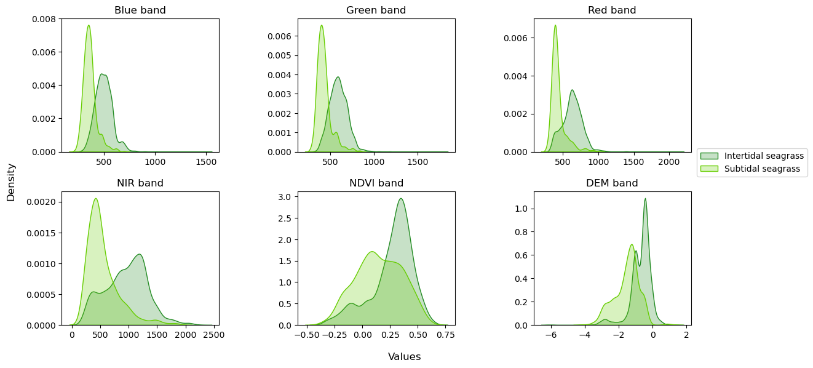
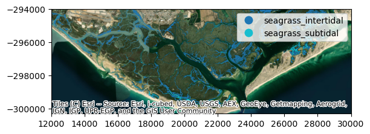

# Seagrass Classification in Ria Formosa
# Mapping seagrass distribution with machine learning approaches

## 1. Overview

This project focuses on mapping seagrass distribution using Random Forest Classifier on satellite imagery, as part of my work for Centro de Ciências do Mar (CCMAR). I aim to develop a model capable of accurately identifying and classifying areas of intertidal and subtidal seagrass within Ria Formosa (a coastal lagoon in southern Portugal). This project incorporates data preprocessing, feature engineering, model tuning, training, and predicting. 

### Settings and requirements
There are two versions of the project.
- Python as main language: this first version of the project was built mainly in Python (v. 3.10.9) with a few R scripts (v. 4.2.1).
- R as unique language: this second version was built entirely using R (v.4.2.1).

<b>The present README will focus on the Python version</b>, but please bear in mind that the logic and structure of both versions are the same, which means you should understand the R version by reading the sections below. If you have any questions, don't hesitate to contact me :)

### Python packages 
To run this project, please ensure that you have the following packages installed in your environment, then import them.


```python
import rasterio as rio
import geopandas as gpd
import pandas as pd
import numpy as np
import tempfile
import fiona
import sklearn
import contextily as cx
import matplotlib.pyplot as plt
import seaborn as sns
```

### R packages
Although the majority of the first version of the project was built in Python, a few steps were developed in R due to some friendly functions available in <i>raster</i> package that were already familiar to me. So make sure you have the <i>raster</i> package installed.

For the R version of the project, you need to install the following packages: <i>raster</i>, <i>terra</i>, <i>magrittr</i>, <i>tidyverse</i>, <i>caret</i> and <i>randomForest</i>.


## 2. Data

The project utilizes 4 primary data sources:

1. Satellite data: High-resolution images (3x3 meters) from 05.08.2019 during low tide, containing four bands: red, green, blue and near-infrared (NIR). We used PlanetScope atmospherically corrected surface reflectance products.

2. Digital Elevation Model (DEM), with a resolution of 10x10 meters acquired in 2011 and obtained based on a set of aerophotogrammetry and airbone LiDAR. This dataset was provided by the Portuguese General Directorate for Territory (DG Território).

3. Habitats point-data: 

- Field data: during field surveys, our team collected data on the habitat class in different locations within Ria Formosa between 2017 and 2020. The data includes variables such as habitat class (e.g., seagrass inter- or subtidal, saltmarsh, unvegetated), coordinates and year. 

- Compilation of existing data on seagrass obtained by systematic review: the data also includes the habitat class, coordinates and year. Only recent data (>2017) was selected for this project.

4. Helpful spatial data: saltmarsh distribution (Martins et al., <i>unpublished</i>) and structures polygons (ICNF) to apply a mask out.

## 3. Preprocessing satellite imagery

### Create mosaic with raw satellite tiles
The raw satellite data was in raster tiles. These rasters were merged as a mosaic using R. The reason I chose to use R instead of Python is because the <i>raster</i> package in R provides a very simple and friendly function (<i>raster::mosaic</i>), which allows to define a function for the overlapping pixels (I chose median).
> You will find this step in src > python > data > raster_preprocessing > 1_merge_mosaic_satellite_tiles.R 

### ROI masking
Now that I have the full satellite imagery, I mask the dataset, keeping only the region of interest (ROI), which is Ria Formosa. This will turn the dataset smaller (from 1.7 GB to 1 GB), which will make it easier to process it afterwards. For this, I created the function mask_roi().


```python
import rasterio.mask

def mask_roi(full_raster, roi_mask, outputRaster):
    with fiona.open(roi_mask, "r") as shapefile:
            shapes = [feature["geometry"] for feature in shapefile]
        
    with rio.open(full_raster) as src:
        out_image, out_transform = rasterio.mask.mask(src, shapes, invert=False)
        out_meta = src.meta
    
    out_meta.update({"driver": "GTiff",
                     "height": out_image.shape[1],
                     "width": out_image.shape[2],
                     "transform": out_transform})
    
    with rio.open(outputRaster, "w", **out_meta) as dest:
        dest.write(out_image)

# Define inputs and outputs
roi_mask = "./data/external/masks/ria_formosa/roi/ROI_ria_formosa.gpkg"
fullRaster = "./data/interim/satellite_mosaic/ria_formosa/mosaic_satellite_reproj.tif"
satellite_roi = "./data/interim/satellite_mosaic/ria_formosa/satellite_roi.tif"

# Apply function
mask_roi(fullRaster, roi_mask, satellite_roi)
```

I get a ROI masked satellite image as output with the same number of bands.


### Calculation of NDVI (Feature Extraction)
With the red and NIR band, I calculated the NDVI (Normalized Difference Vegetation Index), which provides valuable information for seagrass mapping, since it is an index that quantifies the density and health of vegetation.  This feature has potential to be a great predictor.


```python
def calculate_ndvi(raster_path, red_band, nir_band, output_path):
    arr = rio.open(raster_path)
    profile = arr.profile

    profile["count"] = 1
    profile["dtype"] = 'float64'

    red = arr.read(red_band).astype(float)
    nir = arr.read(nir_band).astype(float)
    
    np.seterr(invalid='ignore')
    ndvi = np.nan_to_num(((nir-red)/(nir+red)), 0)

    with rio.open(output_path, 'w', **profile) as dst:
        dst.write(ndvi, indexes = 1)


# Define output
NDVI_path = "./data/interim/ndvi/ndvi_ria_formosa.tif"

# Apply function
calculate_ndvi(satellite_roi, 1, 4, NDVI_path)

```

As an output, I get a one-band raster image with same extent and dimensions of the ROI-masked satellite dataset.

### Raster Stack
At this point, I have a ROI-masked raster dataset (4-band), a NDVI raster dataset (single-band) and the elevation (DEM) dataset (single-band). With these datasets, I create a 6-band raster stack. I did this in R using <i>raster::stack</i> function, which is very simple and easy to use, besides familiar to me.

> You find this step in src > python > data > raster_preprocessing > 3_stack.R

This stack dataset will be used to extract the feature values for model training and testing, and will also be used to predict seagrass distribution on it once the ML model is done.

### DEM, structures and saltmarsh mask

According to a study by our research group (De Los Santos et al., <i>unpublished</i>), the upper elevation limit for intertidal seagrass distribution in Ria Formosa is 0.391 m. If elevation is greater than 0.391 m, the habitats you may find are low, middle and high saltmarsh. If elevation is less or equal to 0.391 m, you may find low saltmarsh, and inter- and subtidal seagrass.
Having this valuable information, I opt to create a mask to exclude areas in which elevation is greater than 0.391 m. 

I also want to exclude the areas of salt marshes and structures, such as clam farms, urban areas and salt flats, since there are no seagrass in those areas. The smaller extent or area covered by the raster dataset, the faster it will be processed and the less mis-classifications the model will potentially make.

> You find this step in src > python > data > raster_preprocessing > additional_ria_mask.py

## 4. Ground truth extraction

The next step involves creating a comprehensive dataset that combines the preprocessed imagery data with the ground truth information.

Before working with the imagery data, it is necessary to organize our point-data (from field and from other sources) into one CSV dataset, then convert it to spatial data (geopackage). After transforming to geopackage, “virtual” point-data on seagrass presence or absence was added to the dataset in areas with high level of confidence, discernible within the imagery.

> You find this step in src > python > data > organize_truth.py

Now, I can finally extract the pixel values for each point location to obtain the labeled dataset, which will be used for our model traning and evaluation.

> You find this step in src > python > data > build_features.py

The final ground truth (labeled) dataset contains the features and target variables. The "seagrass_class" column is the target variable and contains values of 1, 2 and 0, which represent intertidal-, subtidal seagrass and absence, respectively. The bands column (i.e. "blue", "green", "red", "nir", "ndvi" and "dem") are the features. The features and labels will be used for model training and testing.


```python
truth_data = pd.read_csv('./data/processed/datasets/ria_formosa_truth_data.csv')

```


We get the pixel value for each band (last six columns) for each habitat class point data.

### Spectral Signatures

After the dataset creation, we analyze the spectral signatures of the satellite imagery data. A spectral signature represents the distribution of pixel values across different bands for each class (presence or absence of seagrass). This analysis provides insights into the discriminative power of the bands in identifying seagrass areas. The spectral signatures are visualized as density plots, with each subplot representing a band, and each class having a separate distribution. 


```python
truth_data = truth_data.loc[(truth_data['habitatclass'] == 'seagrass intertidal') | (truth_data['habitatclass'] == 'seagrass subtidal')]

features = ['blue', 'green', 'red', 'nir', 'ndvi', 'dem']
subset = features
subset.append('habitatclass')

truth_subset = truth_data[subset]
truth_subset = truth_subset[truth_subset['dem'] > -100] # Exclude very small values

# Visualizing: creating figure with 6 subplots (1 per band)
fig_rows = 2
fig_cols = 3

subplots_indexes = []

for i in range(fig_rows):
    for j in range(fig_cols):
        subplots_indexes.append((i, j))

fig, axs = plt.subplots(nrows=fig_rows, ncols=fig_cols, figsize=(13.5, 6))

class_ids = np.unique(truth_subset['habitatclass'])
colours = ['#228B22', '#66CD00']  

sns.set_palette(sns.color_palette(colours))

for class_id in class_ids:
        for (i, j), band in zip(subplots_indexes, features):
                title = "{} band".format(str.capitalize(band))
                curr_data = truth_subset[truth_subset['habitatclass']==class_id]
                sns.kdeplot(curr_data[band], fill=True, ax=axs[i,j]).set(xlabel=None, ylabel=None, title=title)

axs[1,0].set_title('NIR band')
axs[1,1].set_title('NDVI band')
axs[1,2].set_title('DEM band')

fig.subplots_adjust(left=0.087, right=0.845,top=0.940, bottom=0.110, hspace=0.3, wspace=0.5)
fig.legend(labels = ['Intertidal seagrass', 'Subtidal seagrass'], bbox_to_anchor=(0.99, 0.6))
fig.supxlabel('Values')
fig.supylabel('Density')
plt.show()
```


    

    


The spectral signatures in Ria Formosa and presented overall different shapes. Although intertidal and subtidal seagrasses were characterized by similar reflectance in some ranges of the NDVI and DEM bands, they presented different spectral reflectance, which allows discrimination between both classes. 

## 5. Random Forest Classifier 
The model I use is Random Forest Classifier. Random forest is a supervised machine learning model that builds multiple decision trees during training and combines their predictions to improve accuracy and reduce overfitting 

### Split data
Before splitting my data, I define the bands columns as features (X), and the "seagrass_class" column as target variable (y). Then, I split my dataset into training and testing (80:20). To maintain proportionality in my dataset, I employed the 'stratify' parameter in the split_train_test function from <i>scikit-learn</i>, which ensured that the distribution of classes in the training and testing sets remained representative of the original data. 


```python
from sklearn.model_selection import train_test_split

## Define features and labels
features = ['blue', 'green', 'red', 'nir', 'ndvi', 'dem']

X = truth_data[features]
y = truth_data['seagrass_class']


## Split into 80% train, 20% test in stratified sampling (keep proportion of classes)
X_train, X_test, y_train, y_test = train_test_split(X, y, stratify=y, test_size = 0.2, random_state=1)
```

### Model tuning and training

For model tuning, grid-search with 5-fold cross validation was done with training data, with the best model hyperparameters being determined by the kappa statistic


```python
from sklearn.ensemble import RandomForestClassifier
from sklearn.model_selection import GridSearchCV
from sklearn.metrics import cohen_kappa_score, make_scorer

rf = RandomForestClassifier(
    random_state=1)

# Define grid of hyperparameters
params_rf = {
        'n_estimators': [120, 200, 280, 400],
        'max_depth': [2, 6, 8, None],
        'min_samples_leaf': [0.0001, 0.001, 0.01, 0.05, 0.1, 0.3, 0.5],
        'max_features': ['log2', 'sqrt']
        }
kappa_score = make_scorer(cohen_kappa_score)

# Perform CV with GridSearchCV
grid_rf = GridSearchCV(estimator=rf, 
                       param_grid=params_rf,
                       cv=5,
                       scoring=kappa_score,
                       verbose=1,
                       n_jobs=-1)
```

Once instanciated, I can now train the model, see the best hyperparameters and best score, and get the best estimator as the best model.


```python
grid_rf.fit(X_train, y_train)

# Get the best model from the hyperparameter tuning, and print its parameters and score
best_model = grid_rf.best_estimator_
print(grid_rf.best_params_)
print(grid_rf.best_score_)

```

    Fitting 5 folds for each of 224 candidates, totalling 1120 fits
    {'max_depth': None, 'max_features': 'log2', 'min_samples_leaf': 0.0001, 'n_estimators': 120}
    0.7915627577282384
    

### Model evaluation

Once I have the model, I predict on the test set in order to assess its performance on unseen data. I evaluated the model using precision, recall, f-score, accuracy and confusion matrix. I obtained the following scores:

|Habitat|Precision|Recall|F-score|
| ------------------|-----------|--------|---------|
|Intertidal seagrass|0.79|0.77|0.78|
|Subtidal seagrass|0.71|0.71|0.76|

Overall accuracy: 82.6%

Kappa: 0.68

Error matrix suggests that the model had good capability of predicting the correct class, with a user accuracy of 79.45% and 81.82% for intertidal and subtidal seagrass, respectively, as shown below.

|Predicted class|Absence|Intertidal seagrass|Subtidal seagrass|User accuracy (%)|
|---------------|------|-----------|---------|---------|
|Absence|705|105|24|84.53|
|Intertidal seagrass|89|379|9|<b>79.45</b>|
|Subtidal seagrass|11|7|81|<b>81.82</b>|
|Producer accuracy (%)|87.58|77.19|71.05|

### Predicting on full satellite stack
Finally, I apply the model to the entire preprocessed dataset (6-band raster stack). As predicted output, I obtain a raster containing values with the classification results, which were then converted into a single geopackage with both seagrass categories. A manual cleaning was perfomed on areas of certainty that there is no such vegetation, such as salinas.


### Ria Formosa seagrass distribution results
As result, I have the distribution of seagrass in Ria Formosa. The areas obtained for intertidal and subtidal seagrass were <b>1033.26 ha</b> and <b>186.08 ha</b>, respectively.


```python
sg_distribution = gpd.read_file('./data/processed/RESULTS/ria_formosa/RF_multi_seagrass_classification_clean.gpkg')

ax = sg_distribution.plot(column='habitat_class', cmap= 'Wistia', legend=True)
ax.set_ylim(-300300, -294000)
ax.set_xlim(12000, 30000)
cx.add_basemap(ax, crs=sg_distribution.crs, source=cx.providers.Esri.WorldImagery)
```


    

    


## 6. Final considerations

This project presents a seagrass classification model for Ria Formosa, which predicted seagrass distribution within the system. Our findings offer a meaningful contribution to the understanding of seagrass distribution in this region. In future applications, this model can be utilized to assess changes in seagrass area and determine whether there have been any decreases or increases.

### Limitations
It is important to note that the model's training, evaluation, and predictions were based on data collected between 2017 and 2019. Therefore, its performance on data from significantly different time periods cannot be guaranteed. Another limitation is that the elevation dataset is from 2011 while the truth and satellite data are from 2019, which could be a potential error factor for the model training, since Ria Formosa's substrate is very dynamic. 

### Future improvements
For future improvements, the use of parallel processing would be a good approach (e.g. Dask), considering that the model took a few hours to predict on full dataset. Furthermore, I did not try segmentation, another approach for machine learning classification in satellite images, which is an object-based image analysis (OBIA) instead of pixel-based. It would be also valuable to try spatial cross-validation for tuning the hyperparameters, as it counts with accounts for the spatial autocorrelation present in spatial datasets.
